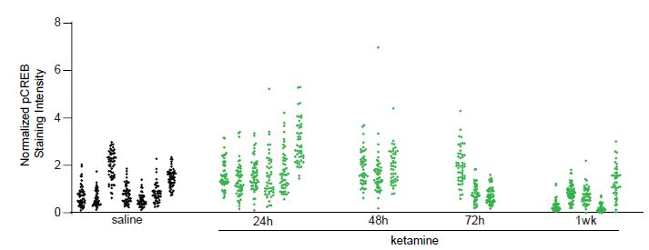

# Introduction {#intro}

Why do the conventional methods fail in the presence of correlated data?

In basic neuroscience research, data dependency due to clustering or repeated measurements is probably the norm rather than the exception. Unfortunately, the most widely used methods under these situations are still the t-test and ANOVA, which do not take dependence into account, thus leading to incorrect statistical inference and misleading conclusions.

We will use a data set collected from our own work to assess the degree of data dependency due to clustering (animal effects) and to illustrate the consequences of ignoring the dependent structure. In this example, we measured the change in pCREB immunoreactivity of 1,200 putative excitatory neurons in mouse visual cortex at different time points: collected at baseline (saline), 24, 48, 72 hours, and 1 week following ketamine treatment, from 24 mice. See @grieco2020subanesthetic for more details. Figure \@ref(fig:S1) shows that the changes in pCREB immunoreactivity tend to be clustered, i.e., measurements from the same animal tend to be more similar to each other than measurements from different animals.

<!-- regular html comment The following code doesn't work, as \ should be replaced by /
knitr::include_graphics(rep('C:\Users\yu790\Desktop\Desktop\Bookdown\bookdown-demo-main\Fig3S.png'))
--> 


```{r S1, out.width="100%", fig.cap="Normalized pCREB staining intensity values from 1,200 neurons (Example 1). The values in each cluster were from one animal. In total, pCREB values were measured for 1,200 neurons from 24 mice at five conditions: saline (7 mice), 24h (6 mice), 48h (3 mice), 72h (3 mice), 1week (5 mice) after treatment."}

```


We compute the intra-class correlation (ICC) to quantify the magnitude of dependency within animals using the software R, a free and open source software (CRAN) (R Development Core Team, 2020). One major advantage of R over other open source or commercial software is that R is widely adopted and continuously reassessed for accuracy, and has a rich collection of user-contributed packages (over 15,000), thus supporting a programing environment for developers and access to cutting-edge statistical methods. In this tutorial, we will use the following R packages: __lme4__ (@bates2014fitting), __ (@pinheiro2007linear), __icc__ (@wolak2015package), __pbkrtest__ (@halekoh2014kenward), __brms__ (@burkner2017brms, @burkner2017advanced), __lmerTest__ (@kuznetsova2017lmertest), __emmeans__ (@lenth2019estimated), __car__ (@fox2018r) , and __sjPlot__ (@ludecke2018sjplot). If they have not been installed onto your computer, you will need to install them by removing the “#” symbol and copy one line at a time to your R console. The “#” symbol is used for commenting out code in R. The installation of a package to a computer only needs to be done once. However, the libraries for data analysis need to be loaded each time you start the R software. We recommend you only load a library when it is needed.

```{r, message=FALSE, warning=FALSE, cache=TRUE}
library(lme4) #if the library has been downloaded to your local computer, your can use install.pckages("lme4") to download it
library(nlme)
library(ICC)
library(brms)
library(pbkrtest)
library(emmeans)
library(car)
library(sjPlot)
```
<!-- install packages in rmd is not a good idea. See https://community.rstudio.com/t/rmd-install-packages-best-practices/42591 -->

We start with reading the pCREB data (__Example 1__) into R. Because the data file is comma separated, we use the function “read.csv” to read it. The option “head=T” reads the first row as the column names. Most R packages of LME require the “long”, also known as “vertical” format, in which data
are organized in a rectangular data matrix, i.e., each row of the dataset contains only the values for one observation. The columns contain necessary information about this observation such as the experimental condition, treatment, cell ID, and animal ID. In this example, the data are stored in a 1,200-by-3 matrix, with the first column being the pCREB immunoreactivity values, the second column being the treatment labels, and the last column being the animal identification numbers. The treatment information is in the second column and it is coded as labels 1 through 5: 1 for baseline (saline), 2-5 for 24, 48, 72 hours, and 1 week after ketamine treatment, respectively. By default, the treatment information is read into numerical values. To convert it to a categorical variable, we apply the “as.factor” function to the treatment variable.


```{r}
# The following lines of code read the Example 1 data
Ex1 = read.csv("https://www.ics.uci.edu/~zhaoxia/Data/BeyondTandANOVA/Example1.txt", head=T)
 
# checking the dimensions of the dataset
dim(Ex1)
 
# checking the names of each column
names(Ex1)
 
# a frequency table for the treatment variable
table(Ex1$treatment_idx)

#Do not forget to factor the treatment IDs
Ex1$treatment_idx = as.factor(Ex1$treatment_idx)
```

Next, we examine the magnitude of clustering due to animal effects by computing the ICC for each treatment group.


```{r}
### load the ICC library
library(ICC) #load the library to conduct ICC analysis with its function ICCbare
 
### conduct ICC analysis by organizing all the information into a data frame
icc.analysis=data.frame(n=rep(0,5), icc=rep(0,5), design.effect=rep(0,5),
effective.n=rep(0,5), M=rep(0,5), cells=rep(0,5))
 
for(i in 1:5){
    trt= Ex1[Ex1$treatment_idx==i,]
    trt$midx=factor(trt$midx)
    icc=ICCbare(factor(trt$midx), trt$res) #ICCbare is a function in the ICC package
    icc.analysis$cells[i]=dim(trt)[1]
    M=dim(trt)[1]/length(unique( trt$midx))
    def=1 + icc*(M-1)
    icc.analysis$n[i]=length(unique( trt$midx))
    icc.analysis$icc[i]=icc
    icc.analysis$design.effect[i]=def
    icc.analysis$effective.n[i]=dim(trt)[1]/def
    icc.analysis$M[i]=M
}
icc.analysis
```


The results are organized in the following table:

```{r}
tmp=t(icc.analysis[,c(6,2)])
row.names(tmp)= c("# of cells", "ICC")
knitr::kable(
  tmp,
  col.names = c("Saline (7 mice)","24h (6 mice)","48h (3 mice)","72h (3 mice)","1wk (5 mice)")
)
```

The ICC indicates that the dependency due to clustering is substantial. Therefore, the 1,200 neurons should not be treated as 1,200 independent cells. When dependence is not adequately accounted for, the type I error rate can be much higher than the pre-chosen level of significance. To see how serious this problem is, we examine the false positives based on the dependence structure observed in our own study. In the simulation script we wrote “simulation_TypeIErrorRate.R” (see download section above), we generated 1000 data sets, each of which follows the same ICC structure and assumes NO difference between the five conditions. Surprisingly, the type I error rate when treating 1,200 neurons as independent observations is over 90% at the significance level of $\alpha=0.05$.

```{r, eval = FALSE, cache= TRUE}
### run the simulation script. It might take 1-2 minutes
source("https://www.ics.uci.edu/~zhaoxia/Data/BeyondTandANOVA/simulation_TypeIErrorRate.R")
```

This is a situation for which the number of observational units is much larger than the number of experimental units. We will show how to use a linear mixed-effects model to correctly analyze the data in the next section.

