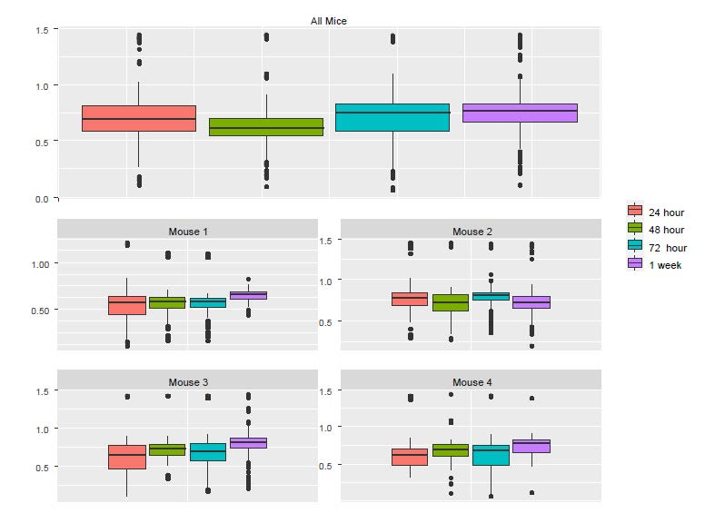

# Conduct LME in R: Example 2

__Example 2__. Data were derived from an experiment to determine how in vivo calcium (Ca++) activity of PV cells (measured longitudinally by the genetically encoded Ca++ indicator GCaMP6s) changes over time after ketamine treatment. We show four mice whose Ca++ event frequencies were measured at 24h, 48h, 72h, and 1 week after ketamine treatment and compare Ca++ event frequency at 24h to the other three time points. In total, Ca++ event frequencies of 1,724 neurons were measured. First let us evaluate the effect of ketamine using LM (or ANOVA, which ignores mouse-specific effect).

```{r, message=FALSE, warning=FALSE}
###load libraries
library(nlme)
library(lme4)
### read the data
Ex2=read.csv("https://www.ics.uci.edu/~zhaoxia/Data/BeyondTandANOVA/Example2.txt", head=T)
Ex2$treatment_idx=Ex2$treatment_idx-4
Ex2$treatment_idx=as.factor(Ex2$treatment_idx)
### change the variable of mouse IDs to a factor
Ex2$midx=as.factor(Ex2$midx)
```

## Wrong analysis
```{r}
### wrong analysis: using the linear model
lm.obj=lm(res~treatment_idx, data=Ex2)
summary(lm.obj)
```
The LM (including ANOVA, t-test) analysis results indicate significantly reduced Ca++ activity at 48h relative to 24h with $p=4.8\times 10^{-6}$, and significantly increased Ca++ event frequency at 1week compared to 24h with $p=2.4\times 10^{-3}$. However, if we account for repeated measures due to cells clustered in mice using LME, most of p-values are greater than 0.05 except that the overall p-value is 0.04.

## LME
```{r, eval = FALSE}
### lme
lme.obj=lme(res~treatment_idx, random= ~ 1| midx, data= Ex2, method="ML")
summary(lme.obj)
anova(lme.obj)
```

The results (estimates $\pm$ s.e., and p-values) the Ca++ event frequency data using _LM_ and _LME_ (__Example 2__).

A TABLE HERE.
```{=latex}
\begin{tabular}{cccc}
& 48h & 72h & 1wk \\ \hline
LM est	 &-0.078$pm$.017 &	0.009$pm$0.017	& 0.050$pm$0.016\\	
LM p &	$4.8\times 10^{-6}$	& 0.595	& $2.4\times 10^{-3}$	\\
LME est	& -0.011$pm$0.014	& 0.020$pm$0.014	& 0.025$pm$0.014	\\
LME p	& 0.424	& 0.150	& 0.069
\end{tabular}
```

## Why pooling data naively is not a good idea? 
To understand the discrepancy between the results from LM and LME, we created boxplots using individual mice as well as all the mice (Figure \@ref(fig:S2)). Although the pooled data and the corresponding p value from the LM show significant reduction in Ca++ activities from 24h to 48h, we see that the only mouse showing a noticeable reduction was Mouse 2. In fact, a close examination of Figure \@ref(fig:S2) suggests that there might be small increases in the other three mice.
```{r S2, out.width="100%", fig.cap="The boxplots of Ca++ event frequencies measured at four time points. (A) Boxplot of Ca++ event frequencies using the pooled neurons from four mice. (B) boxplots of Ca++ event frequencies stratified by individual mice."}

```

To examine why the pooled data follow the pattern of Mouse 2 and not that of other mice, we checked the number of neurons in each of the mouse-by-time combinations.

```{r}
# one mouse contributed 43% cells
# the number of cells in each animal-time combination
table(Ex2$midx, Ex2$treatment_idx)
# compute the percent of cells contributed by each mouse
rowSums(table(Ex2$midx, Ex2$treatment_idx))/1724
```


```{=latex}
\begin{tabular}{cccccc}
& 24h & 48h & 72h & 1wk & Total\\ \hline
Mouse 1 & 81 & 254 &	88	& 43	& 466(27$\%$)\\
Mouse 2	& 206	& 101	& 210	& 222	& 739 (43$\%$)\\
Mouse 3	& 33	& 18	& 51	& 207	& 309 (18$\%$)\\
Mouse 4	& 63	& 52	& 58	& 37	& 210 (12$\%$)\\
Total	& 383	& 425	& 407	& 509	& 1,724 (100$\%$)
\end{tabular}
```

__The above table doesn't work__

The last column of the table above shows that Mouse 2 contributed 43% cells, which likely explains why the pooled data are more similar to Mouse 2 than to the other mice. The lesson from this example is that naively pooling data from different animals is a potentially dangerous practice, as the results can be dominated by a single animal that can misrepresent the data. Application of LME solves this troubling potential problem as it takes dependency and weighting into account.

## Remark: on the minimum number of levels for using random-effects
In this example, the number of levels in the random-effects variable is four, as there are four mice. This number may be smaller than the recommended number for using random-effects. However, as discussed in @gelman2006data, using a random-effects model in this situation of a small sample size might not do much harm. An alternative is to include the animal ID variable as a factor with fixed animal effects in the conventional linear regression. Note that neither of the two analyses is the same as fitting a linear model to the pooled cells together, which erroneously ignores the between-animal heterogeneity and fails to account for the data dependency due to the within-animal similarity. In a more extreme case, for an experiment using only two monkeys for example, naively pooling the neurons from the two animals faces the risk of making conclusions mainly from one animal and unrealistic homogeneous assumptions across animals, as discussed above. A more appropriate approach is to analyze the animals separately and check whether the results from these two animals “replicate” each other. Exploratory analysis such as data visualization is highly recommended to identify potential issues.

