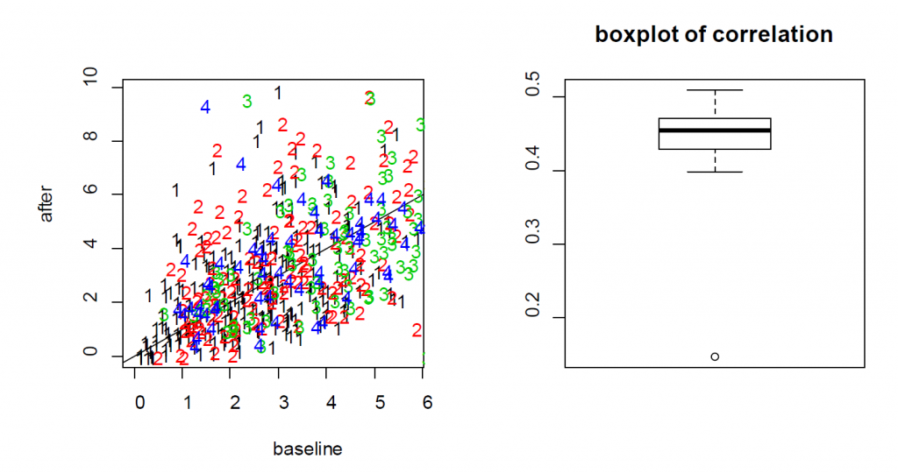

# Conduct LME in R: Example 3

__Example 3__. In this experiment, Ca++ event integrated amplitudes are compared between baseline and 24h after ketamine treatment. 622 cells were sampled from 11 mice and each cell was measured twice (baseline and after ketamine treatment). As a result, correlation arises from both cells and animals, which creates a three-level structure: measurements within cells and cells within animals. It is clear that the ketamine treatment should be treated as a fixed effect. The choice for random effects deserves more careful consideration. The hierarchical structure, i.e., two observations per cell and multiple cells per animal suggests that the random effects of cells should be nested within individual mice. By including the cell variable in the random effect, we implicitly use the change from “before” to “after” treatment for each cell. This is similar to how paired data are handled in a paired t-test. Moreover, by specifying that the cells are nested within individual mice, we essentially model the correlations at both mouse and cell levels.
```{R, eval = FALSE}
library(nlme)
library(lme4)
Ex3=read.csv("https://www.ics.uci.edu/~zhaoxia/Data/BeyondTandANOVA/Example3.txt", head=T)
```
## Wrong analysis with lm, paired or unpaired t-test
```{R, eval = FALSE}
#### wrong analysis: using the linear model
summary(lm(res~treatment, data=Ex3[!is.na(Ex3$res),])) #0.0036
#### wrong anlaysis using t tests (paired or unpaired)
t.test(Ex3[Ex3$treatment==1,"res"], Ex3[Ex3$treatment==2,"res"], var.eq=T)
t.test(Ex3[Ex3$treatment==1,"res"], Ex3[Ex3$treatment==2,"res"])
t.test(Ex3[Ex3$treatment==1,"res"], Ex3[Ex3$treatment==2,"res"], paired=T)
```

##LME
```{R, eval = FALSE}
#correct analysis
lme.obj1=lme(res~ treatment, random =~1| midx/cidx, data= Ex3[!is.na(Ex3$res),], method="ML")
summary(lme.obj1)
```

For the treatment effect, LME and LM produce similar estimates; however, the standard error of the LM is larger. As a result, the p-value based on LME is smaller (0.0036 for LM vs 0.0001 for LME). In this example, since the two measures from each cell are positively correlated, as shown in the Figure \@ref(fig:S3), the variance of the differences is smaller when treating the data as paired rather than independent. As a result, LME produces a smaller p-value than the t-test. As a result, the more rigorous practice of using cell effects as random effects leads to a lower p-value for __Example 3__.


```{R S3, out.width="100%", fig.cap="(Left) the scatter plot of Ca++ event integrated amplitude at baseline vs 24h after treatment for the neurons from four mice (labeled as 1, 2, 3 and 4) indicates that the baseline and after-treatment measures are positively correlated. (Right) boxplot of the baseline and after-treatment correlations of the 11 mice."}

```

## A note on “nested” random effects
When specifying the nested random effects, we used “random =~1| midx/cidx”. This leads to random effects at two levels: the mouse level and the cells-within-mouse level. This specification is important if same cell IDs might appear in different mice. When each cell has its unique ID, just like “cidx” variable in Example 3, it does not matter and “random =list(midx=~1, cidx=~1)” leads to exactly the same model.

```{R, eval = FALSE}
### to verify that the cell IDs are indeed unique
length(unique(Ex3$cidx))
#lme.obj2 is the same as lme.obj
lme.obj2=lme(res~ treatment, random =list(midx=~1, cidx=~1), data=Ex3[!is.na(Ex3$res),], method="ML")
summary(lme.obj2)
```

## On models with more random effects
The above LME model only involves random intercepts. When there are random effects due to multiple sources, it is often recommended to fit a large model (in the sense of as many random effects as possible) to avoid obtaining false positives. However, studies also find that fitting the maximal model can cause decreased statistical power. Visualization is a useful exploratory tool to help identify an appropriate model. Figure \@ref(fig:S4) shows two common ways to visualize data in an exploratory data analysis: the scatter plots and the so-called “spaghetti” plots. The spaghetti plots indicate that neurons are quite different from each other in terms of both baseline values and
changes; the scatter plots with linear model fit suggest that the animals are different from each other at least at the starting baseline. Together, they suggest that random slopes are needed at least at the neuron level.

Here we consider three alternative models (lme.obj3, lme.obj4, lme.obj5) that include additional random effects. More specifically, lme.obj3 includes random slopes only at the neuron level; lme.obj4 includes random slopes only at the animal level; and lme.obj5 includes random slopes for both neurons and animals.


```{R S4, out.width="100%", fig.cap="Ca++ event integrated amplitudes at baseline vs 24h after treatment for the neurons from four mice (labeled as A, B, C and D) with each dot representing a neuron. The four plots on the left are “spaghetti” plots of the four animals with each line representing the values at baseline and 24h after treatment for a neuron; the four plots on the right report the before-after scatter plots (with fitted straight lines using a simple linear regression)."}

```

```{R, eval = FALSE}
#mouse: random intercepts; neuron: both random intercepts and random slopes
#(independence not assumed)
lme.obj3=lme(res~ treatment, random=list(midx=~1, cidx=~treatment), data=
Ex3[!is.na(Ex3$res),], method="ML")
summary(lme.obj3)
anova(lme.obj1, lme.obj3)
#mouse: random intercepts and random slopes (independence not assumed); neuron: random intercepts
lme.obj4=lme(res~ treatment, random=list(midx=~treatment, cidx=~1), data= Ex3[!is.na(Ex3$res),], method="ML")
summary(lme.obj4)
#mouse: random intercepts and random slopes; neuron: random intercepts and random slopes
lme.obj5=lme(res~ treatment, random= ~ 1+treatment | midx/cidx, data= Ex3[!is.na(Ex3$res),], method="ML")
summary(lme.obj5)
anova(lme.obj1, lme.obj3)
anova(lme.obj1, lme.obj4)
anova(lme.obj3, lme.obj5)
```

The comparisons indicate that lme.obj3 improves the basic model lme.obj1 substantially; the improvement brought by lme.obj4 is less impressive; and lme.obj3, the model with random intercepts and slopes at the neuron level, and random intercepts at the animal level appears adequate. This is
supported by the observable differences in baseline values and changes even for cells within the same animal (Figure \@ref(fig:S4)). This suggests that including random intercepts and slopes at the neuron level is necessary.

## A note on the testing of random-effects. 
The comparisons using the “anova” function suggests that lme.obj4, which assumes random intercepts and random slopes at the animal level and random intercepts at neuron level, might be adequate. It should be kept in mind that these comparisons based on likelihood ratio tests and the p-values are conservative. This is because these hypothesis problems are testing parameters at their boundary (@self1987asymptotic). Without getting into many details, the consequence is that the null distribution for the likelihood ratio test is no longer valid and the p-value will be overestimated. Obtaining the correct null distribution is not straightforward and requires advanced considerations beyond the scope of this article. However, @fitzmaurice2012applied suggests the ad-hoc rule to use a level of significance α=0.1, instead of the typical α =0.05, when judging the statistical significance of the likelihood ratio test. We adopted this suggestion in interpreting the results above.

It should also be noted that decisions should not be based on tests and p-values alone. Results can be significant with a very small effect size and large sample size or might not reach significance from a moderate or large effect size but based on a small sample size. Rather, these decisions should be based on study design, scientific reasoning, experience, or previous studies. For example, different animals are expected to have different mean levels on outcome variables; thus, it is reasonable to model the variation due to animals by considering animal specific effects. A similar argument is the inclusion of baseline covariates such as age in many medical studies even when they are not significant. Also, when random
slopes are included, it is typically recommended to include the corresponding random intercepts. For example, if the random slopes (for treatment) are included at the animal level, it is also sensible to include the animal-specific random intercepts.
