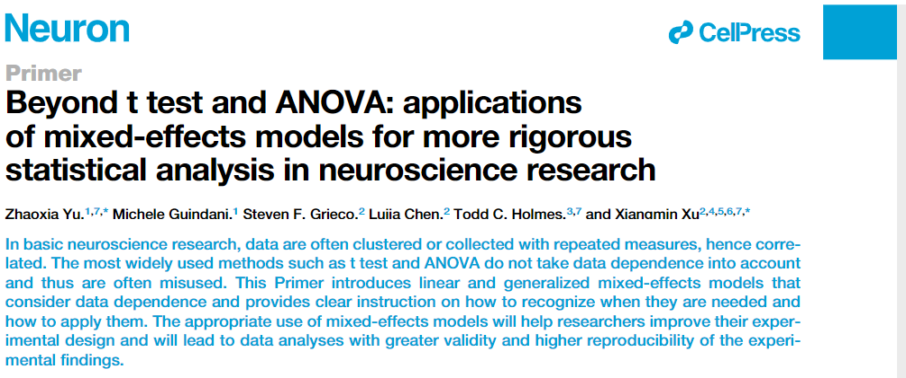

--- 
title: "Mixed-effects model and its application in neuroscience"
author: "Zhaoxia Yu, Michele Guindani, Steven F. Grieco, Lujia Chen, Todd C. Holmes, Xiangmin Xu"
date: "`r Sys.Date()`"
site: bookdown::bookdown_site
output: bookdown::gitbook
documentclass: book
bibliography: [book.bib, packages.bib, mixed-effects.bib]
biblio-style: apalike
link-citations: yes
github-repo: rstudio/mm-in-neuroscience
description: "This is the online supplemental to accomany Yu Z, Guindani M, Grieco SF, Chen L, Holmes TC, Xu X. (2022) Beyond t-Test and ANOVA: applications of mixed-effects models for more rigorous statistical analysis in neuroscience research. Neuron. 110: 21-23."
---

# Supplemental data download
This is the online supplemental to accompany Yu Z, Guindani M, Grieco SF, Chen L, Holmes TC, Xu X. (2022) Beyond t-Test and ANOVA: applications of mixed-effects models for more rigorous statistical analysis in neuroscience research. Neuron. 110: 21-23.
<https://doi.org/10.1016/j.neuron.2021.10.030>.


The data used in this supplementary can be download from the following website:
<https://www.ics.uci.edu/~zhaoxia/Data/BeyondTandANOVA/>.

```{r, out.width="100%"}

```

```{r include=FALSE}
# automatically create a bib database for R packages
knitr::write_bib(c(
  .packages(), 'bookdown', 'knitr', 'rmarkdown'
), 'packages.bib')
```
